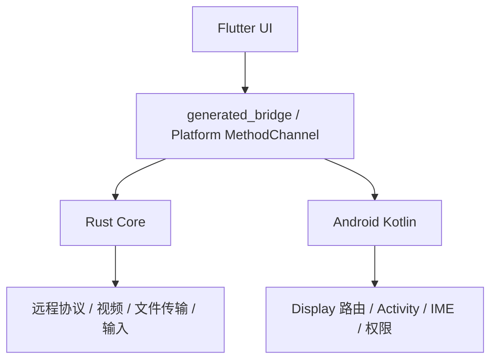

# KEMI 远程桌面：下一会话接续手册与提示词

> 用途：把本文件交给新的 AI 会话或开发者，使其不依赖旧聊天记录即可继续开发。
>
> 当前基线日期：2026-07-29
> 当前版本：`1.4.12+70`
> 功能代码基线：`8f4c18c577a2352ba7d270ec4a350ef22c3d9abc`
> GitHub 备份：`git@github.com:caucy2026/rust-desk.git`，分支 `master`

---

## 1. 新会话先执行的提示词

把下面整段发送给新的开发会话：

```text
你正在继续开发 KEMI 远程桌面 Android PAD 项目。项目不是当前 VS Code 的 webcam/android 工作区，真实代码仓固定在：

/Users/newlink/kemi/RustDesk/client

开始前必须按顺序执行：
1. cd /Users/newlink/kemi/RustDesk/client
2. 阅读 AGENTS.md
3. 阅读 kemi-docs/SESSION-HANDOFF.md
4. 阅读 kemi-docs/CHANGELOG-KEMI.md 的第七至十节
5. 涉及双屏时阅读 kemi-docs/dual-screen-port.md
6. 涉及键盘时阅读 kemi-docs/cross-display-keyboard.md，并以该文档最新章节和当前代码为准
7. 执行 git status --short、git log --oneline -8、git remote -v，确认真实基线

当前版本为 1.4.12+70，文件传输并行浮窗的功能代码基线为 8f4c18c57。文档提交和后续开发会使 HEAD 继续前进，必须用 git rev-parse HEAD 和 git ls-remote backup refs/heads/master 核对当前本地与远端提交。

不可回退的产品行为：
- Android PAD 主屏是 Display 0，远程桌面运行在 Display 2 的 RemoteActivity。
- 远控页三点菜单必须保留“Transfer file/传输文件”入口，不允许移动、隐藏或替换入口。
- 文件传输必须显示为居中的圆角浮窗，宽度和高度均为屏幕的 60%。
- 文件传输浮窗必须创建独立 UUID/FFI 会话；不能关闭、复用或重启后台视频的 gFFI 会话。
- 打开和关闭文件传输浮窗时，后台远程视频必须持续播放。
- Android 本地文件默认优先打开 /storage/emulated/0/Download；历史 local_dir 不能覆盖这个初始默认值。
- Android 文件传输删除功能保持禁用。
- 首页显示 KEMI远程桌面PAD版 v<APK版本>，版本必须读取 PackageInfo，而不是旧预编译 Rust .so 的版本。
- 当前版本源必须一致：Cargo.toml=1.4.12、Cargo.lock rustdesk=1.4.12、flutter/pubspec.yaml=1.4.12+70。

工作方式：
- 先查当前代码和官方/原项目源码，不猜实现。
- 修改前说明根因和最小方案；不要改无关入口、布局或会话生命周期。
- 代码修改后先跑针对性 flutter analyze，再跑 flutter build apk --debug。
- 当前可用 Flutter SDK 是 /Users/newlink/flutter/bin，命令前执行 export PATH=/Users/newlink/flutter/bin:$PATH。
- Debug APK 输出为 flutter/build/app/outputs/flutter-apk/app-debug.apk。
- 当前设备为 192.168.1.10:5555，安装后必须用 dumpsys package 核对 versionName/versionCode/lastUpdateTime。
- 不要因为 release AOT 的 x64 gen_snapshot 在 Apple Silicon 上需要 Rosetta，就误判整个项目不能编译；本项目已验证 flutter build apk --debug 可直接成功。
- 提交前更新 kemi-docs/CHANGELOG-KEMI.md。
- GitHub 备份直接在本仓使用 backup 远端：git push backup master。origin 是 rustdesk 官方上游，不要推送 origin。
- 如果 backup/master 比本地领先，先 fetch，再将已提交改动 rebase 到 backup/master；不要强推，不要丢远端历史。

完成任何任务时必须给出：改动文件、根因、验证命令、构建结果、设备结果（若部署）、提交哈希和远端核验哈希。
```

---

## 2. 项目身份与目标

KEMI 远程桌面是基于 RustDesk 定制的 Android PAD 远程桌面客户端。主要目标不是重做 RustDesk 协议，而是在保留 RustDesk Flutter + Rust 核心能力的基础上适配定制双屏设备。

目标硬件和运行形态：

| 项目 | 当前约定 |
|---|---|
| 设备 | Android PAD，当前 ADB 型号 `huanglong` |
| 主屏 | Display 0 |
| 副屏 | Display 2 |
| 主屏职责 | 应用主页、连接管理、跨屏键盘目标屏之一 |
| 副屏职责 | RemoteActivity、远程桌面视频、触摸操作 |
| 远程输入 | Flutter 输入模型 + Rust FFI；跨屏软键盘由 Android 原生代理 |
| 文件传输 | 独立文件传输 Session，以 60% × 60% 浮窗叠加在远控视频上 |

当前产品要求：

1. 两个屏幕都可以触摸。
2. 远控页面的视频不能因打开文件传输或键盘代理而停止。
3. 文件传输是辅助浮窗，不替换远控页面。
4. Android 文件页默认进入 Download。
5. PAD 版本禁止删除本地/远端文件，避免误操作。
6. 版本号必须在首页可见，并与 APK 包版本一致。

---

## 3. 当前仓库与 Git 基线

### 3.1 本地仓库

```text
/Users/newlink/kemi/RustDesk/client
```

所有代码阅读、修改、构建和提交都在这个目录进行。不要把 `/Users/newlink/workspace/android` 当作本项目仓库；后者是另一个 webcam 数据维护工作区。

### 3.2 远端

```text
origin  git@github.com:rustdesk/rustdesk.git
backup  git@github.com:caucy2026/rust-desk.git
```

- `origin`：RustDesk 官方上游，只用于参考和拉取，不向其推送 KEMI 定制。
- `backup`：KEMI GitHub 备份仓，开发分支是 `master`。

### 3.3 已验证功能代码基线

```text
8f4c18c57 feat(mobile): run file transfer in parallel overlay session
b5eaedfa2 feat(mobile): shrink file transfer overlay to 60% height, default Android home to /Download
7416ebb34 feat(mobile): render file transfer as floating overlay card above remote desktop
3696df999 fix(mobile): pass connToken when returning from file transfer to remote desktop
154959586 feat(mobile): stabilize file transfer handoff and disable delete on Android
```

上述文件传输最终行为对应的功能代码基线为：

```text
8f4c18c577a2352ba7d270ec4a350ef22c3d9abc
```

本接续文档和后续工作会产生新提交，因此不要把该固定哈希当作永远不变的 HEAD。每次接手都执行：

```bash
git rev-parse HEAD
git ls-remote backup refs/heads/master
```

---

## 4. 顶层目录架构

```text
client/
├── AGENTS.md                     # 仓库开发规则，第一份必读文档
├── Cargo.toml                    # Rust workspace 和 crate 版本
├── Cargo.lock                    # Rust 锁文件
├── src/                          # RustDesk Rust 客户端/服务核心
│   ├── client/                   # 客户端连接与协议处理
│   ├── server/                   # 视频、音频、输入、服务端能力
│   ├── platform/                 # 平台相关实现
│   ├── ipc/                      # IPC
│   ├── ui/                       # 旧 UI/会话接口相关代码
│   └── flutter_ffi.rs            # Flutter 与 Rust 的 FFI 入口之一
├── libs/
│   ├── hbb_common/               # 公共配置、协议、protobuf
│   ├── scrap/                    # 屏幕采集/编解码相关
│   ├── enigo/                    # 输入注入
│   └── clipboard/                # 剪贴板
├── flutter/                      # 当前主要 UI 和 Android 工程
│   ├── pubspec.yaml              # Flutter 依赖与版本号
│   ├── lib/
│   │   ├── main.dart             # Flutter 入口、双屏 RemoteActivity 参数监听
│   │   ├── mobile/               # Android/iOS 页面和组件
│   │   ├── desktop/              # 桌面端页面
│   │   ├── models/               # FFI、输入、文件、键盘代理等模型
│   │   ├── common/               # 通用组件和工具
│   │   └── generated_bridge.dart # Rust/Flutter 生成桥接，勿手改
│   └── android/
│       ├── app/build.gradle      # Android application 配置
│       └── app/src/main/
│           ├── AndroidManifest.xml
│           ├── kotlin/com/carriez/flutter_hbb/
│           └── res/
├── kemi-docs/                    # KEMI 定制文档
├── .github/workflows/            # 上游 CI 工作流
└── target/                       # Rust 构建产物，不提交无关生成物
```

---

## 5. 三层架构



### 5.1 Flutter 层

主要负责页面、状态和交互：

- `flutter/lib/mobile/pages/home_page.dart`：PAD 首页标题和版本。
- `flutter/lib/mobile/pages/remote_page.dart`：远控画面、工具栏、三点菜单、键盘代理入口、文件传输浮窗入口。
- `flutter/lib/mobile/pages/file_manager_page.dart`：文件浏览、传输 UI、独立文件 Session。
- `flutter/lib/models/model.dart`：`FFI`、主 Session、视频/输入模型。
- `flutter/lib/models/file_model.dart`：本地/远端目录读取、传输任务、初始目录顺序。
- `flutter/lib/models/native_model.dart`：平台初始化、Android home directory、MethodChannel 封装。
- `flutter/lib/models/keyboard_proxy_model.dart`：Flutter 侧键盘代理状态。

### 5.2 Rust 层

负责 RustDesk 协议、连接类型、视频、输入、文件传输和底层 Session。

关键事实：

- 单个 Session 的 `ConnType` 互斥，一个 Session 不能同时是 `DEFAULT_CONN` 和 `FILE_TRANSFER`。
- 整个客户端可以创建多个 Session。
- 因此当前实现是“视频 Session + 文件传输 Session”并行，而不是在一个 Session 中混合两种类型。

不要再把“单 Session 类型互斥”误解为“客户端只能有一个 Session”。

### 5.3 Android Kotlin 层

目录：

```text
flutter/android/app/src/main/kotlin/com/carriez/flutter_hbb/
├── MainActivity.kt
├── RemoteActivity.kt
├── SessionState.kt
├── KeyboardProxyManager.kt
├── KeyboardProxyActivity.kt
├── KeyboardKeyEventMapper.kt
├── PermissionRequestTransparentActivity.kt
├── InputService.kt
├── MainService.kt
├── FloatingWindowService.kt
├── MainApplication.kt
├── RdClipboardManager.kt
└── ...
```

主要负责：

- 把 Activity 启动到指定 Display。
- 为两个 Flutter engine 分别注册平台通道。
- 跨屏键盘代理的 Activity、状态机和 IME 输入连接。
- Android 权限、无障碍、前台服务、悬浮窗。

---

## 6. Android 双屏架构

### 6.1 Activity 分工

| Activity | 默认 Display | 职责 |
|---|---:|---|
| `MainActivity` | 0 | 主应用、主页、连接管理、主 Flutter engine |
| `RemoteActivity` | 2 | 副屏远程桌面、触摸、第二 Flutter engine |
| `KeyboardProxyActivity` | 动态选择对面屏 | 创建原生输入连接并显示系统 IME，不提供可见业务 UI |

### 6.2 双屏启动

`MainActivity.kt` 中 `launchRemoteOnDisplay2(...)`：

1. 接收 Flutter 的 `launch_remote_on_display2`。
2. 构建 `RemoteActivity` Intent。
3. 通过 `ActivityOptions.setLaunchDisplayId(2)`（当前代码使用反射兼容设备）启动到 Display 2。

`RemoteActivity.kt` 在 `onCreate()` 检查实际 `displayId`：

- 如果错误运行在 `Display.DEFAULT_DISPLAY`，执行迁移逻辑重新启动到 Display 2。
- 连接参数通过 `remoteChannel` 交给副屏 Flutter engine。

### 6.3 双 Flutter engine 的通道

| 通道 | 所属 | 作用 |
|---|---|---|
| `mChannel` | MainActivity 和 RemoteActivity 各自注册 | Flutter `gFFI.invokeMethod(...)` 的 Android 平台方法，包括权限和键盘代理 |
| `remoteChannel` | RemoteActivity | 连接参数、生命周期、主副屏消息 |

重要约束：

- 新增 Android 平台方法时，要判断主屏和副屏两个 Flutter engine 是否都需要实现。
- 只加到 `MainActivity.mChannel` 可能导致副屏 `MissingPluginException`。
- `RemoteActivity` 已单独实现 `keyboard_proxy_prepare/open/close/release` 和权限回调通道。

---

## 7. 跨屏键盘架构

完整需求以 `kemi-docs/cross-display-keyboard.md` 为准。当前核心组件：

### 7.1 `KeyboardProxyManager.kt`

进程级单例和唯一状态源：

- 状态：`hidden`、`opening`、`visible`、`closing`。
- 保存递增 `requestId` 和发起时 `sessionId`。
- 根据源 Activity 当前 Display 动态选择对面 Display：
  - 源在非 0 屏时，目标为 Display 0。
  - 源在 Display 0 时，选择在线的非 0 Display，当前通常为 Display 2。
- 监听 Display 添加、状态变化和移除。
- 向 Flutter 发布 `keyboard_proxy_state`。
- 转发 `keyboard_proxy_commit_text` 和 `keyboard_proxy_key`。

### 7.2 `KeyboardProxyActivity.kt`

- 在目标 Display 启动。
- 使用原生 `EditText/InputConnection` 接收 IME。
- 监听 `WindowInsets.Type.ime()` 判断键盘是否真实可见。
- 中文组合输入、提交文本和删除键有去重/状态保护。
- 关闭或 Display 断开时释放代理。

### 7.3 Flutter `RemotePage`

`remote_page.dart` 使用：

- `keyboard_proxy_prepare`
- `keyboard_proxy_open`
- `keyboard_proxy_close`
- `keyboard_proxy_release`

文件传输浮窗打开前暂时 `release` 键盘代理，关闭后重新 `prepare`，但不会关闭远控视频 Session。

不可随意修改：

- requestId/sessionId 校验。
- opening/visible/closing 状态转换。
- 输入去重时间窗。
- 双 engine 的 MethodChannel 实现。
- 页面销毁和 App 后台时的 release 路径。

---

## 8. 文件传输最终架构

### 8.1 入口

入口固定在：

```text
RemotePage 底部工具栏三点按钮
  -> showActions(id)
  -> Transfer file / 传输文件
  -> _openFileTransferFromRemote(id, connToken)
```

代码位置：`flutter/lib/mobile/pages/remote_page.dart`。

不可把入口移动到首页，不可因优化浮窗而删除或隐藏三点菜单项。

### 8.2 浮窗

`_openFileTransferFromRemote(...)` 使用 `showGeneralDialog`：

- `barrierDismissible: false`
- 半透明黑色遮罩
- 250ms FadeTransition
- 页面为 `FileManagerPage(isOverlay: true)`

`FileManagerPage` 的 overlay 容器：

```text
width  = screen.width  * 0.60
height = screen.height * 0.60
borderRadius = 16
```

### 8.3 并行 Session

这是最重要的实现约束。

远控视频继续使用全局 `gFFI`。浮窗模式在 `FileManagerPage.initState()` 创建：

```dart
_ffi = widget.isOverlay ? FFI(Uuid().v4obj()) : gFFI;
model = _ffi.fileModel;
```

随后通过 `_ffi.start(..., isFileTransfer: true, connToken: token)` 建立独立文件传输 Session。

因此：

```text
Session A: gFFI, DEFAULT_CONN, 远控视频持续解码
Session B: _ffi, FILE_TRANSFER, 文件浮窗独立运行
```

关闭浮窗时：

- `model.close()` 清理文件模型。
- `_ffi.close()` 只关闭文件传输 Session。
- 不调用 `gFFI.close()`。
- 不重新 `gFFI.start()`。

禁止恢复旧逻辑：

```text
打开前 gFFI.close()
关闭后 gFFI.start()
```

旧逻辑会导致视频中断、黑屏、重复握手和 Session 生命周期竞态。

### 8.4 Android 默认 Download

`flutter/lib/models/native_model.dart`：

```dart
final storageDir = (await ExternalPath.getExternalStorageDirectories())[0];
_homeDir = '$storageDir/Download';
```

`flutter/lib/models/file_model.dart` 的本地目录候选顺序必须让 Android `home` 位于历史 `savedDir/local_dir` 之前，否则旧保存目录会把 Download 覆盖掉。

当前目标路径：

```text
/storage/emulated/0/Download
```

若设备厂商返回不同外部存储根路径，以 `ExternalPath` 结果拼接 `Download` 为准。

### 8.5 Android 删除限制

`FileManagerPage` 中 `_deleteEnabled => !isAndroid`。

- 文件项 Delete 置灰。
- 批量删除按钮禁用。
- 运行时保留二次保护。

除非用户明确要求，不要恢复 Android 删除能力。

---

## 9. 品牌、版本和包信息

### 9.1 当前版本源

| 文件 | 当前值 |
|---|---|
| `Cargo.toml` | `version = "1.4.12"` |
| `Cargo.lock` 的 rustdesk package | `version = "1.4.12"` |
| `flutter/pubspec.yaml` | `version: 1.4.12+70` |

Android 最终应显示：

```text
versionName=1.4.12
versionCode=70
```

### 9.2 首页版本号

`home_page.dart`：

- 标题：`KEMI远程桌面PAD版`
- 版本来源：`PackageInfo.fromPlatform().version`

必须读取 APK 的 PackageInfo。不要改回 `bind.mainGetVersion()`，因为当前预编译 Rust `.so` 可能返回旧版本 `1.4.9`，会出现 APK 是 1.4.12、首页却显示 1.4.9 的假象。

### 9.3 Android 包

```text
applicationId/package: com.carriez.flutter_hbb
application label: KEMI远程桌面
minSdk: 22
targetSdk: 33
compileSdk: 34
```

Manifest 主要权限：

- `MANAGE_EXTERNAL_STORAGE`
- `READ_EXTERNAL_STORAGE` / `WRITE_EXTERNAL_STORAGE`
- `INTERNET`
- `ACCESS_NETWORK_STATE`
- `FOREGROUND_SERVICE`
- `SYSTEM_ALERT_WINDOW`
- `RECORD_AUDIO`
- `WAKE_LOCK`

---

## 10. 当前可用开发环境

2026-07-29 实测：

```text
OS: macOS Apple Silicon (Apple M4)
Flutter: 3.29.3 stable
Dart: 3.7.2
Flutter SDK: /Users/newlink/flutter
Java: OpenJDK 17.0.19 Temurin
Cargo: 1.97.1
ADB device: 192.168.1.10:5555
Device model: huanglong / hi3781v730_tablet
```

每个新终端先执行：

```bash
export PATH=/Users/newlink/flutter/bin:$PATH
```

不要使用旧文档中的 `/tmp/flutter_sdk/flutter/bin`，那是历史临时路径。

---

## 11. 构建、安装和验证

### 11.1 静态检查

从 Flutter 目录运行：

```bash
export PATH=/Users/newlink/flutter/bin:$PATH
cd /Users/newlink/kemi/RustDesk/client/flutter

flutter analyze \
  lib/mobile/pages/file_manager_page.dart \
  lib/mobile/pages/home_page.dart \
  lib/mobile/pages/remote_page.dart \
  lib/models/file_model.dart \
  lib/models/native_model.dart
```

当前存在一些上游已有的 info 级提示：`WillPopScope`、`withOpacity`、`MaterialStateProperty` 弃用和 setter 风格提示。不要为当前功能顺手做大范围 API 重构。

### 11.2 Debug APK

当前已验证命令：

```bash
export PATH=/Users/newlink/flutter/bin:$PATH
cd /Users/newlink/kemi/RustDesk/client/flutter
flutter build apk --debug
```

输出：

```text
/Users/newlink/kemi/RustDesk/client/flutter/build/app/outputs/flutter-apk/app-debug.apk
```

2026-07-29 最近产物约 151MB。

构建会出现以下已知警告，但 Debug 构建仍成功：

- `file_picker` desktop inline implementation 警告。
- 部分 Android plugin 建议 compileSdk 35，而当前项目固定 compileSdk 34。
- Android x86 目标未来移除提示。

除非任务就是升级构建链，不要为消除警告随意升级 AGP/Kotlin/compileSdk；当前依赖约束是为了兼容现有项目。

### 11.3 Apple Silicon 与 Release

`./build_android.sh` 或 release AOT 可能调用 Flutter 缓存中的 `darwin-x64/gen_snapshot`，在没有 Rosetta 的 Apple Silicon 上失败。

已验证的开发闭环使用 Debug：

```bash
flutter build apk --debug
```

不要看到 release 的 Rosetta 提示就声称整个项目无法编译，也不要未经用户确认安装系统依赖。

### 11.4 安装

```bash
adb devices -l
adb -s 192.168.1.10:5555 install -r -d \
  /Users/newlink/kemi/RustDesk/client/flutter/build/app/outputs/flutter-apk/app-debug.apk
```

### 11.5 核验设备实际版本

```bash
adb -s 192.168.1.10:5555 shell dumpsys package com.carriez.flutter_hbb \
  | grep -E "versionCode|versionName|lastUpdateTime"
```

期望：

```text
versionCode=70
versionName=1.4.12
```

设备验证时必须核对 `lastUpdateTime`。以前出现过“本地 APK 已构建，但安装命令被取消，设备仍运行旧 APK”的问题；不能只凭源代码或 APK 文件时间判断设备已更新。

### 11.6 启动和日志

```bash
adb -s 192.168.1.10:5555 shell am force-stop com.carriez.flutter_hbb
adb -s 192.168.1.10:5555 shell am start \
  -n com.carriez.flutter_hbb/.MainActivity --display 0

adb -s 192.168.1.10:5555 logcat -c
adb -s 192.168.1.10:5555 logcat \
  | grep -E "FileManagerPage|FileModel|Transfer file|KeyboardProxy|RemoteActivity|FATAL EXCEPTION"
```

---

## 12. 文件传输验收流程

实机至少验证：

1. 首页显示 `KEMI远程桌面PAD版 v1.4.12`。
2. 从主屏发起远控，副屏 RemoteActivity 显示远程视频。
3. 点击远控页三点菜单，确认存在“传输文件”。
4. 点击后出现居中、圆角、60% 宽 × 60% 高浮窗。
5. 浮窗背后的远程视频持续变化，不冻结、不黑屏、不重新 Connecting。
6. Local 默认目录为 Download，而不是旧的 Android 或存储根目录。
7. Remote 目录正常读取。
8. 执行一个小文件双向传输并核对大小或 hash。
9. Android Delete 仍为禁用。
10. 关闭浮窗，远程视频继续播放，远控触摸仍可用。
11. 重复打开/关闭至少 10 次，确认没有 Session 泄漏、黑屏或按钮消失。

尚未完整归档的待办：

- 小文件双向传输 + Hash 对比的正式验收记录。
- 更长时间的并行视频 + 文件传输稳定性测试。
- 连续开关文件浮窗的 Session/内存监测。

---

## 13. GitHub 提交与备份

### 13.1 提交前

```bash
cd /Users/newlink/kemi/RustDesk/client

git status --short
git diff --stat
git diff --check
```

确认：

- 不包含 APK、build、target、日志等无关产物。
- 不覆盖用户已有修改。
- `kemi-docs/CHANGELOG-KEMI.md` 已更新。
- 已运行针对性分析和 Debug APK 构建。

### 13.2 本地提交

```bash
git add <明确的文件列表>
git commit -m "feat(mobile): 描述"
```

推荐前缀：

- `feat(mobile):`
- `feat(android):`
- `fix(mobile):`
- `fix(android):`
- `docs:`

不要默认使用 `git add -A`，先明确哪些文件属于当前任务。

### 13.3 获取 GitHub 状态

```bash
git fetch backup master
git log --graph --oneline --decorate --max-count=10 master backup/master
```

如果本地已经线性领先 `backup/master`，直接进入推送。

如果本地与 `backup/master` 分叉：

```bash
git rebase backup/master
```

解决冲突后：

```bash
git add <冲突文件>
GIT_EDITOR=true git rebase --continue
```

原则：

- 保留当前最终行为和远端已有历史。
- rebase 后重新运行 `git diff --check` 和构建。
- 不使用 `git push --force`，除非用户明确授权且已说明影响。

### 13.4 推送到 GitHub

```bash
git push backup master
```

不要执行：

```bash
git push origin master
```

`origin` 是官方 RustDesk 上游，不是 KEMI 备份仓。

### 13.5 推送后核验

```bash
git ls-remote backup refs/heads/master
git rev-parse HEAD
git status --short
```

要求：

- 远端哈希与本地 HEAD 完全一致。
- `git status --short` 无输出。

### 13.6 从 GitHub 恢复

新机器或新目录：

```bash
git clone git@github.com:caucy2026/rust-desk.git
cd rust-desk
git checkout master
```

核对：

```bash
git log -1 --oneline
grep -n '^version' Cargo.toml flutter/pubspec.yaml
```

然后按第 11 节配置 Flutter、构建 APK。

---

## 14. 常见误判与禁止事项

### 14.1 不要误判 Session 能力

错误结论：视频和文件传输只能二选一。

准确结论：单个 Session 类型互斥，但客户端可以创建两个 Session。当前已经用独立 UUID/FFI 实现并行。

### 14.2 不要修改文件传输入口

用户要求优化的是弹出窗口，不是入口。三点菜单及其“传输文件”项必须保留。

### 14.3 不要只看源代码判断设备版本

必须用 `adb install` 的 `Success` 和 `dumpsys package` 的 `lastUpdateTime` 证明设备已经换包。

### 14.4 不要用 Rust `.so` 版本显示首页版本

当前 `.so` 可能仍带旧版本。首页必须以 APK PackageInfo 为准。

### 14.5 不要让历史目录覆盖 Download

Android 初始候选目录中，home/Download 必须在 saved `local_dir` 前面。

### 14.6 不要随意升级构建链

compileSdk 34、targetSdk 33、Kotlin 1.8.22 和当前依赖强制版本是已工作的组合。升级是独立任务，必须全量验证。

### 14.7 不要把旧文档当成当前代码

`dual-screen-port.md` 包含历史构建路径、旧设备 IP 和旧版本记录。架构背景可参考，但当前事实以：

1. 当前源代码；
2. 本接续文档；
3. `CHANGELOG-KEMI.md` 最新章节；
4. 实际构建/设备输出；

为准。

---

## 15. 下一会话启动检查清单

```bash
cd /Users/newlink/kemi/RustDesk/client

# 1. 仓库状态
git status --short
git log --oneline -8
git remote -v

# 2. 基线核验
git rev-parse HEAD
git ls-remote backup refs/heads/master

# 3. 版本核验
grep -n '^version' Cargo.toml flutter/pubspec.yaml

# 4. 工具链
export PATH=/Users/newlink/flutter/bin:$PATH
flutter --version
java -version
cargo --version
adb devices -l

# 5. 阅读文档
sed -n '1,240p' kemi-docs/SESSION-HANDOFF.md
sed -n '1,260p' kemi-docs/CHANGELOG-KEMI.md
```

新的任务开始后，先找到控制行为的最小代码路径，再修改并验证。不要仅根据聊天摘要猜代码状态。

---

## 16. 文档索引

| 文档 | 用途 |
|---|---|
| `AGENTS.md` | RustDesk 仓库开发规则 |
| `kemi-docs/SESSION-HANDOFF.md` | 当前事实、接续提示词、构建部署和 GitHub 流程 |
| `kemi-docs/README.md` | KEMI 文档总入口 |
| `kemi-docs/CHANGELOG-KEMI.md` | 时间线、问题根因、修复和验证记录 |
| `kemi-docs/cross-display-keyboard.md` | 跨屏键盘唯一规格和状态机 |
| `kemi-docs/dual-screen-port.md` | 双屏移植背景与历史架构 |
| `kemi-docs/GIT-OPS.md` | Git/GitHub 操作速查 |

---

> 维护规则：每次完成影响架构、构建、设备、版本或 Git 流程的变更，都必须同步更新本文件相关章节和 `CHANGELOG-KEMI.md`。
